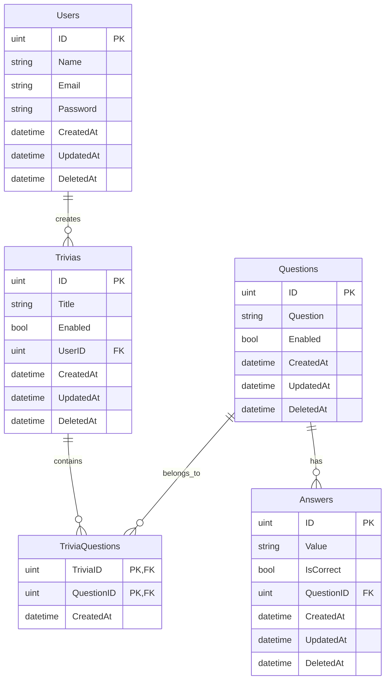

# Trivia App API

A RESTful API for managing trivia games built with Go and SQLite using GORM.

## Database Schema

### User Model
```sql
Users
├── ID          (uint)      Primary Key
├── Name        (string)    Not Null
├── Email       (string)    Unique, Not Null
├── Password    (string)    Not Null
├── CreatedAt   (datetime)
├── UpdatedAt   (datetime)
└── DeletedAt   (datetime)  Soft Delete
```

### Trivia Model
```sql
Trivias
├── ID          (uint)      Primary Key
├── Title       (string)    Not Null
├── Enabled     (bool)      Default: true
├── UserID      (uint)      Foreign Key -> Users
├── CreatedAt   (datetime)
├── UpdatedAt   (datetime)
└── DeletedAt   (datetime)  Soft Delete
```

### Question Model
```sql
Questions
├── ID          (uint)      Primary Key
├── Question    (string)    Not Null
├── Enabled     (bool)      Default: true
├── CreatedAt   (datetime)
├── UpdatedAt   (datetime)
└── DeletedAt   (datetime)  Soft Delete
```

### Answer Model
```sql
Answers
├── ID          (uint)      Primary Key
├── Value       (string)    Not Null
├── IsCorrect   (bool)      Default: false
├── QuestionID  (uint)      Foreign Key -> Questions
├── CreatedAt   (datetime)
├── UpdatedAt   (datetime)
└── DeletedAt   (datetime)  Soft Delete
```

### Trivia Questions (Junction Table)
```sql
TriviaQuestions
├── TriviaID    (uint)      Primary Key, Foreign Key -> Trivias
├── QuestionID  (uint)      Primary Key, Foreign Key -> Questions
└── CreatedAt   (datetime)
```

## Entity Relationships



## Relationship Details

1. **Users - Trivias** (One-to-Many)
    - Un usuario puede crear múltiples trivias
    - Cada trivia pertenece a un usuario

2. **Trivias - Questions** (Many-to-Many)
    - Una trivia puede tener múltiples preguntas
    - Una pregunta puede pertenecer a múltiples trivias
    - Relación manejada por la tabla TriviaQuestions

3. **Questions - Answers** (One-to-Many)
    - Una pregunta puede tener múltiples respuestas
    - Cada respuesta pertenece a una única pregunta

## Features

- Soft Delete implementado para todos los modelos principales
- Timestamps automáticos (CreatedAt, UpdatedAt)
- Restricciones de integridad referencial
- Índices para mejor rendimiento

## Technical Details

- **Database**: SQLite
- **ORM**: GORM
- **File**: `trivia.db`

## Installation & Setup

1. Clone the repository
```bash
git clone https://github.com/yourusername/trivia-app.git
```

2. Install dependencies
```bash
go mod tidy
```

3. Run migrations
```bash
go run main.go
```

## Development

The database will be automatically created and migrated when you run the application for the first time.

### Default Constraints

- User email must be unique
- Trivia title has a maximum length of 50 characters
- Questions have a maximum length of 255 characters
- Answers have a maximum length of 255 characters
- All timestamps are automatically managed by GORM

### Soft Delete

All main entities (Users, Trivias, Questions, Answers) implement soft delete, meaning records are not physically deleted from the database but rather marked as deleted with a timestamp in the DeletedAt column.

## Contributing

1. Fork the repository
2. Create your feature branch (`git checkout -b feature/AmazingFeature`)
3. Commit your changes (`git commit -m 'Add some AmazingFeature'`)
4. Push to the branch (`git push origin feature/AmazingFeature`)
5. Open a Pull Request